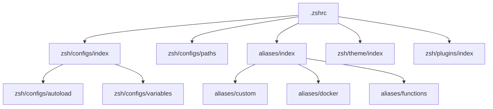

# 🌌 Bhoomit's Dotfiles (`bhumit070/dotfiles`)

Welcome to my personal dotfiles repository! This repo contains my fully customized, highly optimized development environment configurations tailored for macOS (`Darwin`) and Linux systems. It features a highly modular Zsh configuration, automated backups, Docker-based local databases, Nginx local proxies, tiling window managers, and premium command-line setups.

---

## 🚀 Quick Setup & Installation

To install and set up this environment, clone this repository directly into your home directory:

```bash
git clone https://github.com/bhumit070/dotfiles.git $HOME/dotfiles
cd $HOME/dotfiles/setup
chmod +x ./zsh-setup.sh
./zsh-setup.sh
```

> [!IMPORTANT]  
> The `zsh-setup.sh` script is the automated orchestrator for this repository. It will:
> 1. Clean and install Zsh plugins (`zsh-autosuggestions`, `zsh-vi-mode`, `fast-syntax-highlighting`).
> 2. Fetch and configure the high-performance **Powerlevel10k** theme.
> 3. Link the modular `.zshrc` file to your home directory (`$HOME/.zshrc`).
> 4. If running on **macOS (Darwin)**: Installs all taps, packages, casks, and VS Code extensions using the synced [brew/Brewfile](file:///Users/bhumit070/dotfiles/brew/Brewfile).
> 5. If running on **Linux**: Automatically installs CLI tools like `bat` and `exa`/`eza` via `apt` or `pacman`.
> 6. Triggers database volume creation (`docker.sh`) and setups the automated backup crontab (`crontab.sh`).

---

## 📂 Repository Structure

The dotfiles are organized into modular, purpose-specific directories:

```
dotfiles/
├── alacritty/          # GPU-accelerated Alacritty terminal configurations
│   └── alacritty.yml   # Multi-theme window & font specifications
├── aliases/            # Modular shell aliases & custom functions
│   ├── custom          # Common CLI enhancements, Git, JS, and Python shortcuts
│   ├── docker          # Docker DB controls, compose commands & kubectl
│   ├── functions       # Custom shell helper functions (VS Code, systemd, etc.)
│   └── index           # Central entry point loading all aliases
├── brew/               # Package manager tracking
│   └── Brewfile        # Taps, CLI tools, macOS casks, and VS Code extensions
├── custom_scripts/     # Custom CLI utilities
│   └── cleanup         # Automatical directory organization utility
├── ghostty/            # Modern Ghostty terminal settings
│   └── config          # Font, split-pane keys & dark mode styling
├── git/                # Global Git defaults
│   └── .gitconfig      # Git identity (Bhoomit) & default branches
├── iterm2/             # iTerm2 profile settings
│   └── ...             # com.googlecode.iterm2.plist
├── mpv/                # Media player scripts & configs
│   ├── mpv.conf        # Fullscreen & video rendering preferences
│   └── scripts/        # OSC thumbnail generators & lua scripts
├── nginx/              # Reverse proxy configurations
│   ├── nginx.conf      # Core daemon, compression & worker controls
│   └── conf.d/         # Virtual hosts (e.g., ui.futr.local -> Vite dev server)
├── scripts/            # Background utility scripts
│   └── update_brewfile.sh # Auto-dumper and pusher for Homebrew
├── setup/              # Shell scripts for setting up the machine
│   ├── zsh-setup.sh    # Main setup bootstrap script
│   ├── docker.sh       # Docker database directories builder
│   └── crontab.sh      # Automated hourly update scheduler
├── starship/           # Modern prompt configurations
│   └── starship.toml   # Custom powerline prompt style and modules
├── vim/                # Neovim preferences
│   └── init.vim        # NERDTree, airline, fzf, and keymappings
├── xmonad/             # Tiling Window Manager configurations for Linux
│   └── xmonad.hs       # Workspaces, layout rules, gaps, scratchpads & xmobar hooks
└── zsh/                # Modular Zsh shells
    ├── configs/        # System history, bindings, autocompletion & paths
    ├── plugins/        # Custom fetched plugin loaders
    └── theme/          # Powerlevel10k setups
```

---

## 🐚 Zsh & Prompts

My shell configuration uses a modern, lightning-fast modular setup. Instead of a single monolithic `.zshrc`, variables, paths, themes, and plugins are loaded in strict order:



### 💫 Starship Prompt
The prompt is styled dynamically using [Starship](https://starship.rs/) configured in [starship/starship.toml](file:///Users/bhumit070/dotfiles/starship/starship.toml) with powerline glyphs and harmonic status colors:
*   **Palette Highlights**: Mint/Aqua (`#7DF9AA` / `#8DFBD2`), Navy Blue (`#1C3A5E`), Sky Blue (`#3B76F0`), and Soft Yellow (`#FCF392`).
*   **Active Modules**: Time segment 󱑍, Directory path with folder icons ﱮ, Current Node.js version, Git branch and metrics (added/deleted lines), and clean terminal indicators (➜ / ✗ / 󱦱).

### 🔌 Zsh Plugins Included
*   **[ZSH-VI-MODE](https://github.com/jeffreytse/zsh-vi-mode)**: Adds seamless Vi editing modes inside the command line.
*   **[ZSH-AUTO-SUGGESTIONS](https://github.com/zsh-users/zsh-autosuggestions)**: Fish-like intelligent history-based autocompletion.
*   **[FAST-SYNTAX-HIGHLIGHTING](https://github.com/zdharma-continuum/fast-syntax-highlighting)**: Real-time syntax validation.

---

## ⚙️ Modular Aliases & Shell Functions

All aliases are sourced from modular files under the `aliases/` directory.

### 🛠️ Common CLI Enhancements
Rust-powered modern alternatives are linked by default if they are available:
*   **`ls` / `sl`**: Replaced with **`eza -lah --icons=always`** (premium file listings).
*   **`cat`**: Replaced with **`bat`** (syntax-highlighted code output).
*   **`grep`**: Replaced with **`rg`** (ultra-fast ripgrep).
*   **`rm`**: Safely points to **`trash`** (moves files to trash instead of permanent deletion).
*   **`vim`**: Points to **`nvim`** (Neovim).
*   **`ip`**: Instantly prints your local IPv4 address.
*   **`cls`**: Quick shortcut for `clear`.

### 📦 Web & Javascript Ecosystem
Speedy shortcuts for package managers:
*   **NPM**: `ni` (install), `nd` (dev-dependency), `nig` (global install), `nii` (init).
*   **Yarn**: `ya` (add), `yd` (add dev), `yg` (global add), `yii` (init).
*   **PNPM**: `pi` (install), `pd` (dev-dependency), `ppg` (global), `pii` (init).
*   **Bundlers**: `vite` points to `yarn create vite`.

### 🐙 Git Shortcuts
*   `gaa`: `git add -A` (stage all changes)
*   `gc`: `git commit`
*   `glc`: Prints the total commit count on the current branch (`git log --oneline | wc -l`).
*   `gpo [branch]`: Pushes to upstream origin on the current (or specified) branch.
*   `gpu [branch]`: Pulls from origin on the current (or specified) branch.

### 🐳 Docker & Kubernetes Shortcuts
*   `k`: Points to `kubectl`.
*   `dps`: Premium Docker process tables: formats ID, status, name, and port forwards.
*   `ddc`: Safely stops and deletes all docker containers *except* the Dozzle logging service.
*   `ddi`: Deletes all unused Docker images.
*   `dcu` / `dcd`: Docker Compose up (detached) and down loading `.env` variables.
*   `dcb` / `dcbnc`: Docker Compose build (normal / no-cache).
*   `dcl`: Docker Compose real-time logs tailing.
*   `dozzle`: Fires up a containerized [Dozzle](https://dozzle.dev/) console on port `5050` to inspect container logs.

### ⚡ Custom Functions (`aliases/functions`)
*   **`vsc [directory]`**: Opens the directory in VS Code and closes the terminal shell. (Defaults to current directory).
*   **`sd [action] [service]`**: Simplifies `systemctl` syntax (actions: `start`, `status`, `stop`, `enable`, `reload`).
*   **`startScreen [service]`**: Spawns a background GNU screen session for a service or attaches to it if it is already running.
*   **`reindexSpotlight`**: Forces a fresh rebuilding of the macOS Spotlight search database.
*   **`cleanup [directory]`**: Moves all loose files in the directory into subfolders categorized by their extensions (e.g. `.pdf` files go to `pdf/`, `.png` to `png/`). Highly useful for cleanups!

---

## 🐳 Docker Database setup

This dotfiles setup includes a localized Docker database management container setup. You can fire up isolated databases mapped to persistent home volumes (`$HOME/docker/`) instantly using these custom aliases:

| Database / Client | CLI Launcher | Exec Shell | Stop & Remove | Base Path | Port | Default User/Pass |
| :--- | :--- | :--- | :--- | :--- | :--- | :--- |
| **MongoDB 6** | `dmongo` | `dmongos` | `dmongostop` | `~/docker/mongodb` | `27017` | *No Auth* |
| **MySQL 8** | `dmysql` | `dmysqls` | `dmysqlstop` | `~/docker/mysql` | `3306` | `root` / *Empty* |
| **PostgreSQL 14** | `dpostgres` | `dpostgress` | `dpostgresstop` | `~/docker/postgres` | `5432` | `bhumit070` / `bhumit070` |

---

## 🔄 Automated Brewfile Synchronization

This setup configures a cron job that automatically runs every hour. It keeps your software footprint perfectly backed up to GitHub without manual intervention:

```
[System State] ──(Hourly cron)──> [brew bundle dump] ──> [Git Diff Check] ──(Changes found)──> [Auto Commit & Push] ──> [GitHub]
```

1.  **Dumps Configuration**: Executes `brew bundle dump --file=~/dotfiles/brew/Brewfile -f`, capturing:
    *   **Formulae**: CLI tools (`fnm`, `fzf`, `neovim`, `ripgrep`, `starship`, `tailscale`, `ffmpeg`, etc.)
    *   **Casks**: GUI apps (`cursor`, `zed`, `brave-browser`, `claude`, `flutter`, `iina`, `tableplus`, etc.)
    *   **VS Code Extensions**: Active plugin configurations (`vscodevim.vim`, `rust-analyzer`, `copilot`, `eslint`, etc.)
    *   **Languages & PMs**: Global NPM dependencies (`eas-cli`, `pm2`, `yarn`, `pnpm`), Cargo tools, and Go packages.
2.  **Verifies Changes**: Run `git diff` against the committed `Brewfile`.
3.  **Syncs to Remote**: If packages have been added or removed, it commits with `"update: brewfile"` and pushes it automatically to your GitHub branch.

> [!TIP]  
> If you have existing crontabs or are setting this up for the first time, ensure your cron setup is working. In [setup/crontab.sh](file:///Users/bhumit070/dotfiles/setup/crontab.sh), the sequence:
> ```bash
> echo "0 * * * * $HOME/dotfiles/scripts/update_brewfile.sh >/dev/null 2>&1" >>mycron
> crontab -l >mycron
> ```
> will overwrite the temp file due to `>`. To append it safely, run:
> ```bash
> (crontab -l 2>/dev/null; echo "0 * * * * $HOME/dotfiles/scripts/update_brewfile.sh >/dev/null 2>&1") | crontab -
> ```

---

## 🖥️ Graphical & Window Configurations

### 🐚 Terminals
*   **Alacritty (`alacritty/alacritty.yml`)**:
    *   Decorations: none (frameless).
    *   Opacity: `0.9` (glassmorphism/translucent backdrop).
    *   Theme: Default set to **Dracula** (with Solarized Light, Solarized Dark, and Doom One configurations built-in).
    *   Font: **MesloLGS NF** (size `14.0`).
*   **Ghostty (`ghostty/config`)**:
    *   Background: Elegant slate grey (`#2A353F`).
    *   Foreground: Pure white (`#ffffff`).
    *   Font size: `18`.
    *   Custom Splits: `Ctrl+D` for a new split pane on the right.
*   **iTerm2 (`iterm2/`)**:
    *   Preconfigured profiles loaded via the plist mapping.

### 🎹 XMonad Tiling Window Manager (`xmonad/xmonad.hs`)
For Linux setups, a high-end XMonad tiling config is provided:
*   **Mod Key**: Set to the Windows/Super key (`mod4Mask`).
*   **Spacing & Gaps**: Spacing of `8px` configured between tiled windows. Gaps are automatically hidden when only a single window is open (`smartBorders`).
*   **Named Scratchpads**: Floating utility pads toggled dynamically:
    *   `terminal`: Custom floating Alacritty terminal at 90% size.
    *   `mocp`: CLI music player.
    *   `calculator`: Floating GUI Qalculate widget.
*   **Custom Layouts**: Accordion tiling, Magnifier layouts, logarithmic spirals, Three-column tile grids, float setups, and tabbed windows.
*   **Multi-Monitor panels**: Starts three separate `xmobar` processes (`xmobar -x [0/1/2]`) mapped to monitors using custom color highlights matching the Doom One palette.

---

## 🌐 Local Development Routing (Nginx)

The Nginx setup (`nginx/nginx.conf`) includes compressed gzip streaming defaults and modular reverse proxy routing inside `nginx/conf.d/default.conf`:

```
Internet/Browser ──(Port 80)──> http://ui.futr.local ──(Reverse Proxy)──> http://localhost:5173 (Vite Dev Server)
```

This maps custom local domain names like **`ui.futr.local`** directly to local Vite servers (`http://localhost:5173`), making building local apps (like payments or dashboard client applications) feel identical to production routing.

---

## 📝 Neovim & Text Editors

*   **Neovim (`vim/init.vim`)**:
    *   Sourced configuration using `vim-plug` for light, robust IDE features.
    *   Loads **NERDTree** (file tree) toggleable with `<C-B>`.
    *   Includes **FZF** integration for rapid fuzzy file finding.
    *   Sets up **vim-airline** for high-fidelity tab/status metrics and **emmet-vim** for superfast HTML expansions.
    *   Activates relative and absolute line numbers (`set number`).
*   **VS Code**:
    *   Managed profile (`profile.code-profile`) backing up visual configurations.
    *   Synchronized extensions listed and backed up within the main Homebrew Brewfile.

---
*Maintained with ❤️ by [Bhoomit](mailto:ganatrabhoomit070@gmail.com)*
